### 1. Abrimos MongoDB

MongoDB esta vacío.

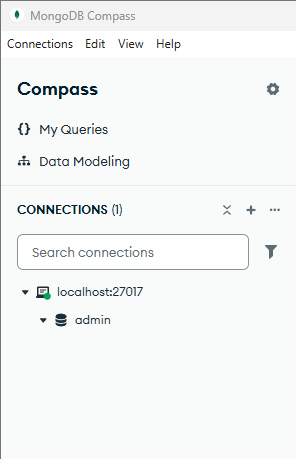

### 2. Cargamos las semillas

Con el siguiente comando en VSCode cargamos las semillas.

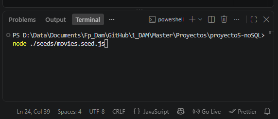

Ahora en MongoDB vemos que han cargado las semillas correctamente.

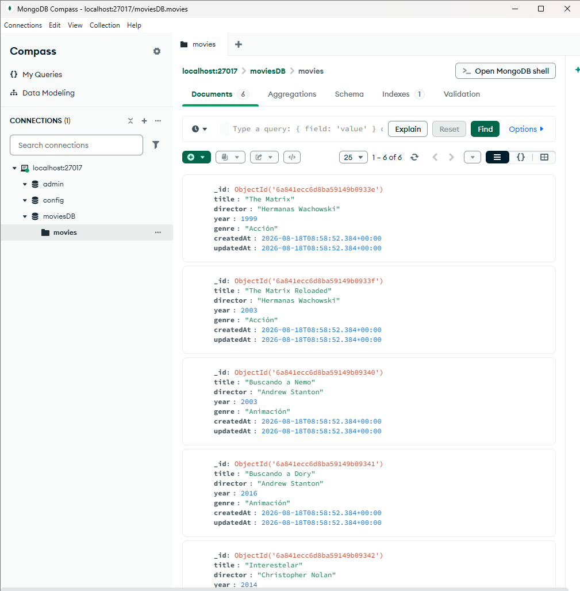

### 3. Levantar el servidor

Hasta el momento Insomnia se muestra así, sin conexión.

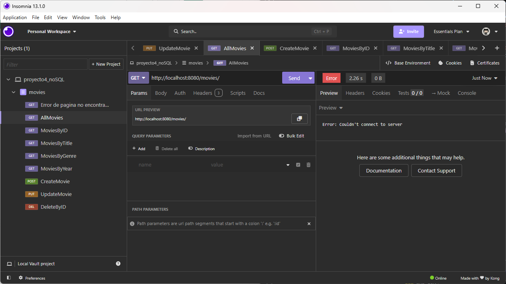

Ejecutamos este comando en VSCode para levantar el servidor.

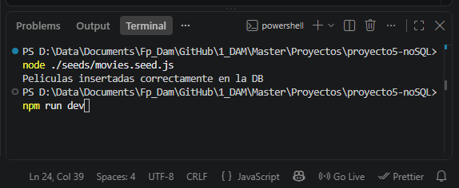

Y ahora ya podemos empezar a ejecutar las peticiones con Insomnia.

### 4. Prueba de peticiones

#### Error pagina no encontrada

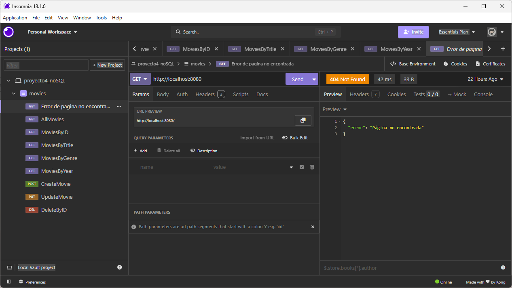

#### Get AllMovies

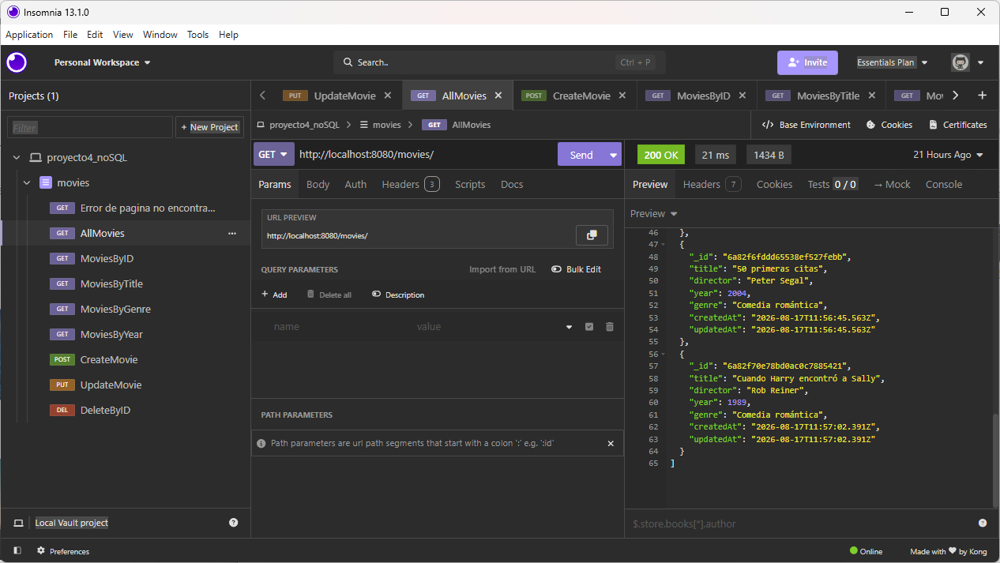

#### Get MoviesByID

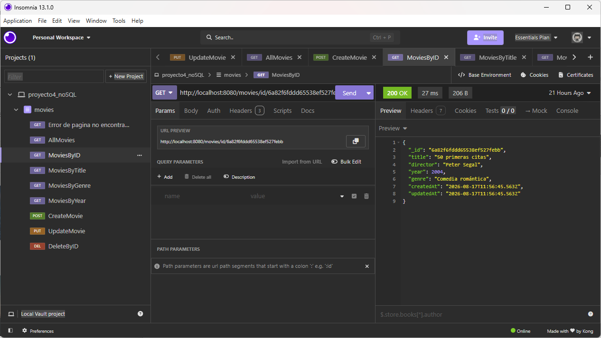

#### Get MoviesByTitle

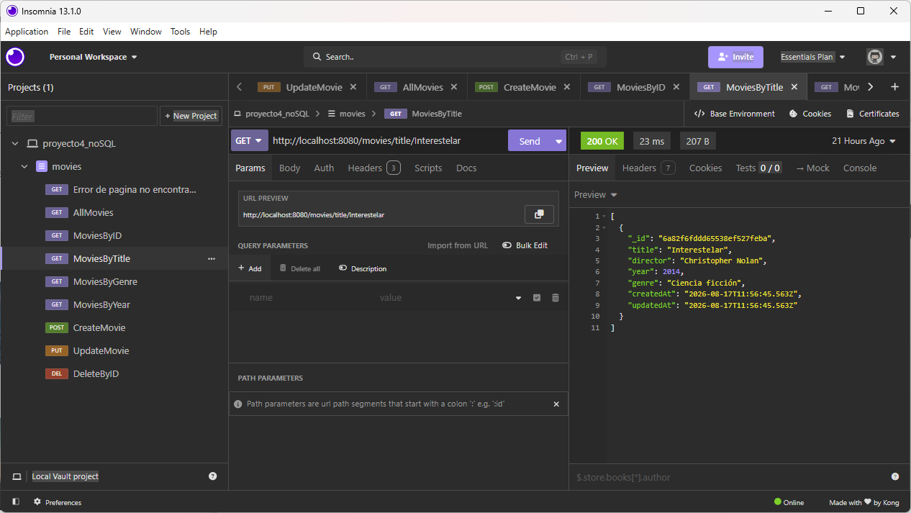

#### Get MoviesByGenre

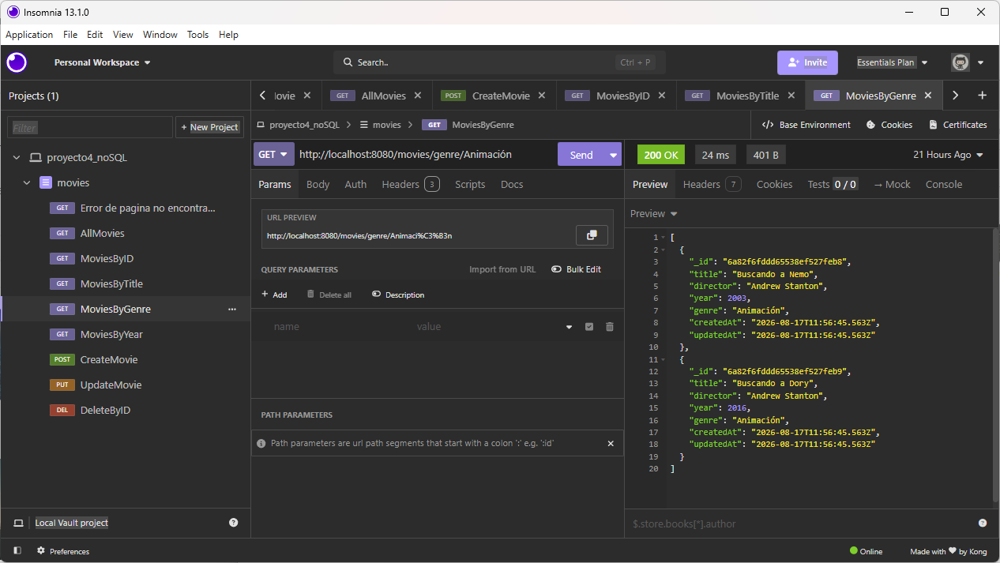

#### Get MoviesByYear

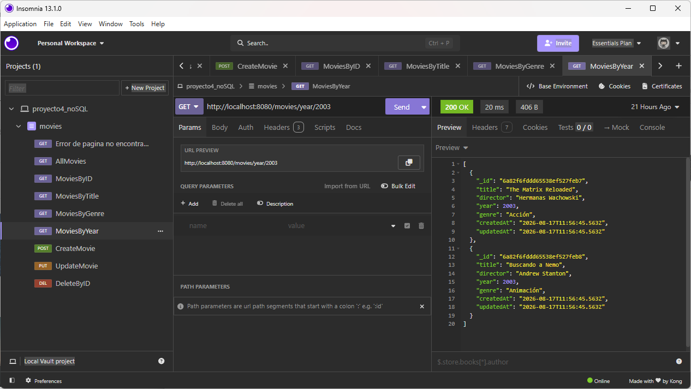

#### Post CreateMovie

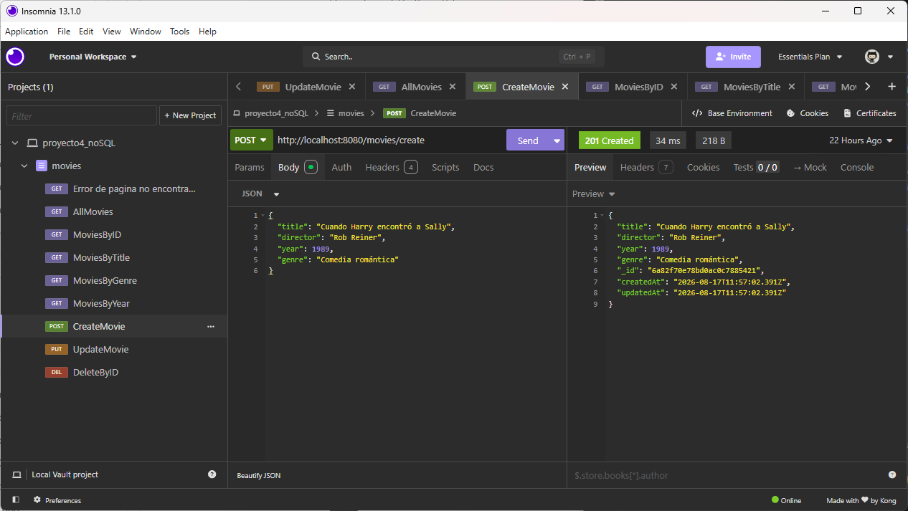

#### Put UpdateMovie

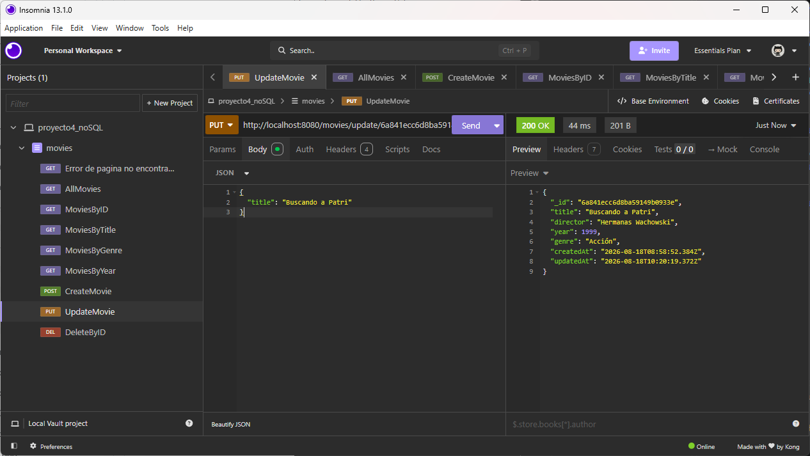

#### Delete DeleteMovie

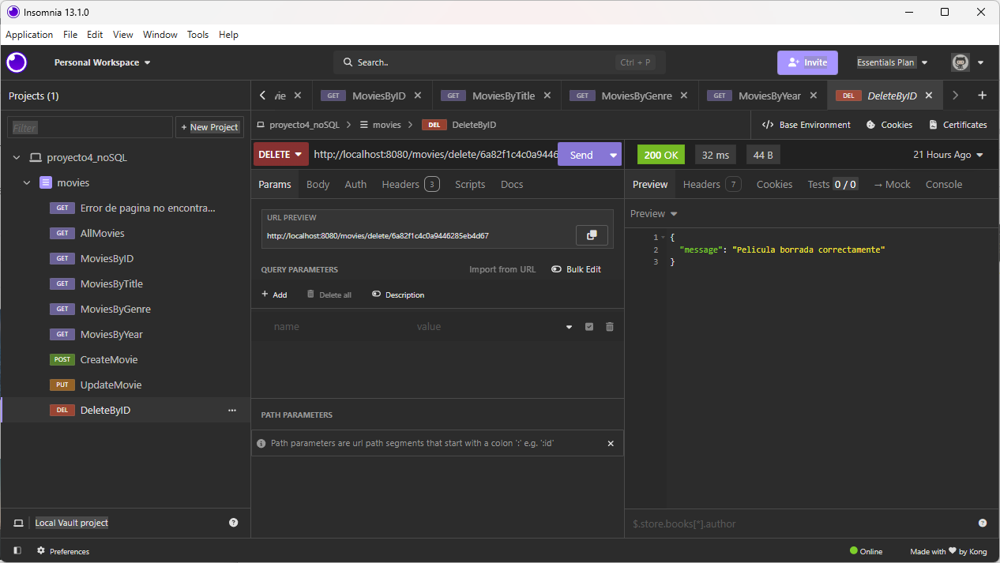
